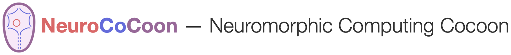

# Adding a new Network Module

To define a new kind of network module, three components must be provided:

* a Java class that determines the user-configurable parameters and the related design time behavior of each module
  instance,
* an icon to depict the module kind and its instance in the visual language workbench,
* templates for PyNN-based Python code to create module instances when the network is simulated

## Java class

The Java class itself corresponds to the language concept of a network module kind. Objects (instances) of this class
are used to represent the module instances of this kind in the visual editor (one object per module instance).
This Java class must belong to the package [de.unibi.hbp.ncc.lang.modules`](ncc/src/de/unibi/hbp/ncc/lang/modules)
and must be a direct or indirect subclass of the abstract class
[`NetworkModule`](ncc/src/de/unibi/hbp/ncc/lang/NetworkModule.java) in the package `de.unibi.hbp.ncc.lang`.
Intermediate (usually abstract) classes can be used to factor out common traits shared by multiple module kinds.

User-configurable design time parameters (*editable properties* in **NeuroCoCoon** terms) must be defined inside the
class as instance variables conforming to the interface type `de.unibi.hbp.ncc.lang.props.EditableProp<T>`, where the
generic type parameter `T` represents the data type of the property value. Typical examples with pre-supplied
implementations include properties that represent

* integral or floating point values (data type `int` or `double`), possibly with a restricted range of values,
  like strictly positive values or probabilities in range `0.0` to `1.0`and an optional unit of measurement;

* references to other language entities, most notably a neuron type or a synapse type;

* a choice from a fixed set of predefined possibilities, similar to an enumeration type in textual languages;

* free-form entry of entity names or arbitrary short explanatory texts.

The following code is an excerpt from the [`WinnerTakeAll`](ncc/src/de/unibi/hbp/ncc/lang/modules/WinnerTakeAll.java)
module kind implementation. Default values for the properties are passed as the last argument to the property
constructors. The parameter for the number of competing populations inside the winner-take-all architecture
determines the number of connection points (ports) of the module instance. Such structural impacts of changes to a
property value are specified when the property is created. This causes the visual to track such changes and to update
the affected parts of the internal program representation. 

``` Java
private final IntegerProp numberOfPopulations, numberOfNeurons;
private final DoubleProp noiseWeight, noiseRate, noiseProbability, synapseDelay;

…

this.numberOfPopulations = new StrictlyPositiveIntegerProp("Number of Outcomes", this, 3)
    .addImpact(EditableProp.Impact.CELL_STRUCTURE);
this.numberOfNeurons = new StrictlyPositiveIntegerProp("Neurons per Population", this, 5);
this.noiseWeight = new NonNegativeDoubleProp("Noise Weight", this, 0.01);
this.noiseRate = new NonNegativeDoubleProp("Rate", this, 20.0).setUnit("Hz");
this.noiseProbability = new ProbabilityProp("Noise Probability", this, 0.7);
this.synapseDelay = new NonNegativeDoubleProp("Synapse Delay", this, 1.0).setUnit("ms");
``` 

TODO: inner class `Creator` and short internal name `resourceFileBaseName` for the module kind, which is used as the
basename for the other two files.

## Icon

TODO: A graphical icon *`basename.png`* for the module. The icon must be a square PNG image, usually with alpha transparency, and
is stored in the directory
[ncc/resources/de/unibi/hbp/ncc/editor/images/lang](ncc/resources/de/unibi/hbp/ncc/editor/images/lang)
for visual language-specific icons. The recommended size for the icon is 256x256 pixels. A scaled-down version is
used to represent the module kind in the editor palette and inside graph nodes for module instances.


**Icon Credits:** winner by cindy clegane from the Noun Project

## Python templates

TODO: A [StringTemplate 4][ST4-Syntax] template group file *`basename.stg`* that defines two Python code fragments.
The first fragment is usually the definition of a Python function or class that builds a module instance.
The second fragment is invoked, possibly multiple times, to create each module instance.

simplified and abbreviated excerpt from [`winner.stg`](ncc/src/de/unibi/hbp/ncc/lang/modules/winner.stg)
```
define_winner_builder() ::= <<
def build_winner_take_all(num_pops, num_neurons,
                          neuron_kind, neuron_params,
                          weight_noise, rate_noise, prob_noise, syn_delay):
    input_population_list, output_population_list = [], []
    
    # Create populations and excitatory connections
    …
    # Create cross-inhibition
    …
    # return internal populations that correspond to the externally visible input ports and output ports
    return { 'in': input_population_list, 'out': output_population_list }
>>

build_winner_instance(winner) ::= <<
build_winner_take_all(<winner.numberOfPopulations>, <winner.numberOfNeuronsPerPopulation>,
    <ref_neuronType(winner.neuronType)>,
    <winner.noiseWeight>, <winner.noiseRate>, <winner.noiseProbability>, <winner.synapseDelay>)
>>
```

TODO: mention ref_xyz templates (from [`python.stg`](ncc/resources/de/unibi/hbp/ncc/resources/python.stg)) for use in build_*modulekind*_instance

[ST4-Syntax]: https://github.com/antlr/stringtemplate4/blob/master/doc/cheatsheet.md
