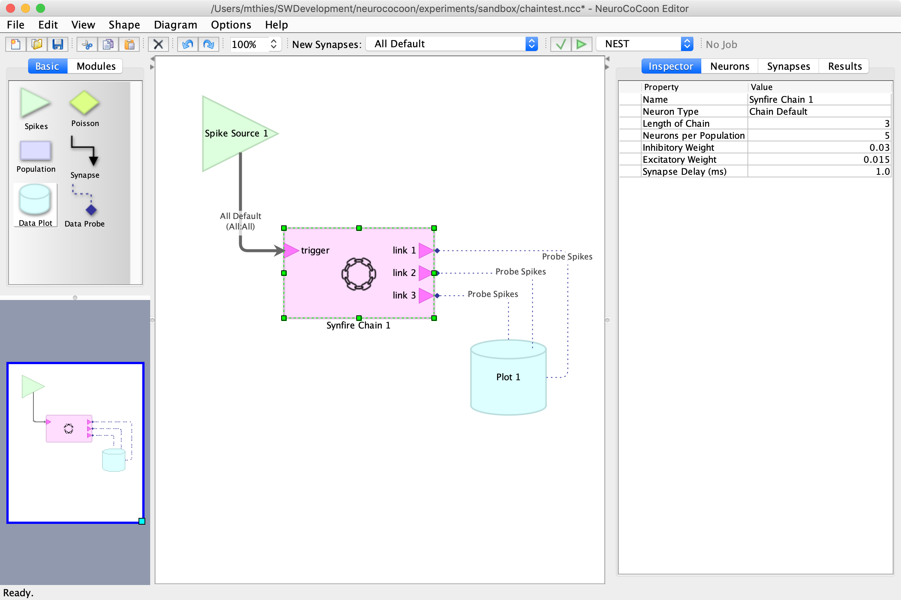

# Installing NeuroCoCoon

## Building

TODO: IntelliJ IDEA by JetBrains s.r.o.

## Installing as a local application

JDK 8

TODO: Download the [latest release][NCC-Release] of the all-in-one runnable Java archive file `ncc-v1.0.0.jar`,
where the last part of the filename reflects the version number.

`java -jar ncc-v1.0.0.jar`

## Prerequisites for running NEST simulations locally

## Installing the collaboratory web app

TODO: CheerpJ by Leaning Technologies
the Java compiler for the Web
converts any Java client application into standard HTML5/WebAssembly/JavaScript
works from Java bytecode, without requiring access to the source code
compatible with 100% of Java (reflection and dynamic classes included)
turn-key solution, works on Java Swing clients, Java applets, and Java libraries
actively developed and supported by Leaning Technologies experts

**NeuroCoCoon** is a **protective** development environment and experimentation **workbench** for
spiking neural networks (*SNN*s) running on **neuromorphic hardware**.

The network is described in a graph-based visual language and is built from **neuron populations** (nodes) and **synapse
connectors** (edges). User-defined **neuron types** and **synapse types** ensure consistent parameter choices for all
related parts of the network architecture.

In addition, predefined **network modules** can be used as building blocks that encapsulate proven and robust
SNN architectural principles. Modules expose only the externally relevant parameters of their constituents.
Multiple instances of the same kind of module may use different parameter settings. This includes structural parameters
that scale the underlying generic module architecture and can influence the number of external connection points
(ports) provided by the module.

A visually created network is then checked for structural and logic errors, before it is translated into
an equivalent [PyNN][PyNN]-based program. Networks can be simulated on the [NEST][NEST] software simulator,
if NeuroCoCoon is running as a local application, or on the [SpiNNaker and BrainScalesS][HBP-NMC] platforms of the
European Horizon 2020 [Human Brain Project][HBP] (*HBP*), if NeuroCoCoon is running as a client side web application inside
the [HBP collaboratory][HBP-Collab].

[NCC-Release]: https://github.com/hbp-unibi/NeuroCoCoon/releases
[IntelliJ]: https://www.jetbrains.com/idea/
[OpenJDK]: https://openjdk.java.net/install/
[Oracle]: https://www.oracle.com/java/technologies/javase-downloads.html
[CheerpJ]: https://www.leaningtech.com/pages/cheerpj.html
[PyNN]: https://neuralensemble.org/PyNN
[NEST]: https://www.nest-initiative.org
[HBP]: https://www.humanbrainproject.eu
[HBP-NMC]: https://www.humanbrainproject.eu/en/silicon-brains/neuromorphic-computing-platform/
[HBP-Collab]: https://collab.humanbrainproject.eu/

