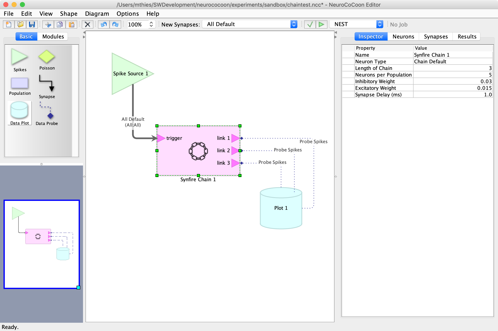

**NeuroCoCoon** is a **protective** development environment and experimentation **workbench** for
spiking neural networks(*SNN*s) running on **neuromorphic hardware**.

The network is described in a graph-based visual language and is built from **neuron populations** (nodes) and **synapse
connectors** (edges). User-defined **neuron types** and **synapse types** ensure consistent parameter choices for all
related parts of the network architecture.

In addition, predefined **network modules** can be used as building blocks that encapsulate proven and robust
SNN architectural principles. Modules expose only the externally relevant parameters of their constituents.
Multiple instances of the same kind of module may use different parameter settings. This includes structural parameters
that scale the underlying generic module architecture and can influence the number of external connection points
(ports) provided by the module.

A visually created network is then checked for structural and logic errors, before it is translated into
an equivalent [PyNN][PyNN]-based program. Networks can be simulated on the [NEST][NEST] software simulator,
if NeuroCoCoon is running as a local application, or on the [SpiNNaker and BrainScalesS][HBP-NMC] platforms of the
European Horizon 2020 [Human Brain Project][HBP] (*HBP*), if NeuroCoCoon is running as a client side web application inside
the [HBP collaboratory][HBP-Collab].

---

This open source software code was developed in part in the Human Brain Project, funded from the
European Union’s Horizon 2020 Framework Programme for Research and Innovation under the
Specific Grant Agreement No. 720270 (HBP SGA1) and 785907 (HBP SGA2).

[PyNN]: https://neuralensemble.org/PyNN
[NEST]: https://www.nest-initiative.org
[HBP]: https://www.humanbrainproject.eu
[HBP-NMC]: https://www.humanbrainproject.eu/en/silicon-brains/neuromorphic-computing-platform/
[HBP-Collab]: https://collab.humanbrainproject.eu/