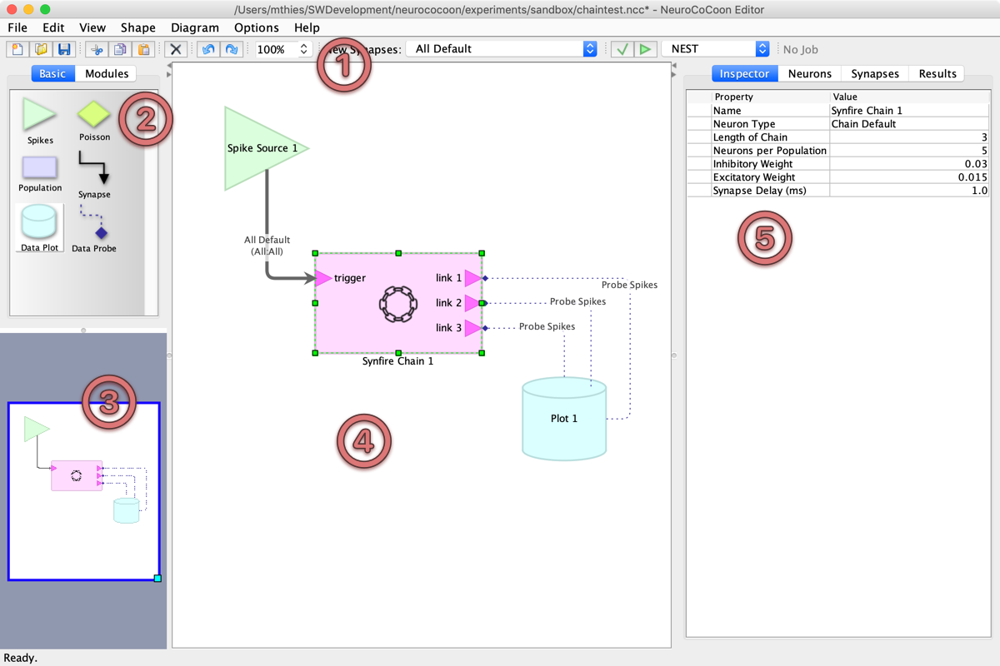
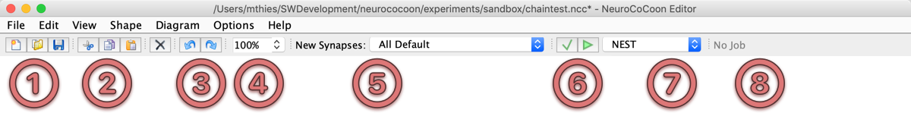
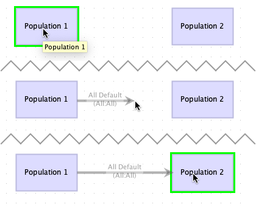
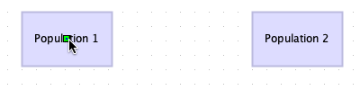
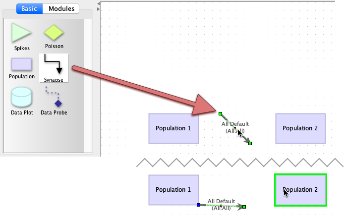
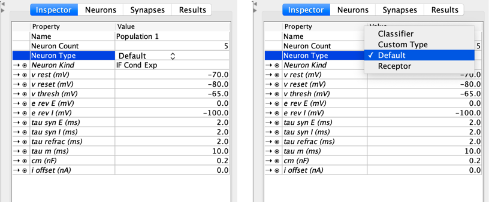
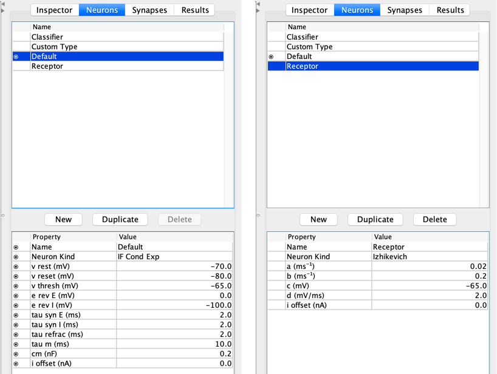
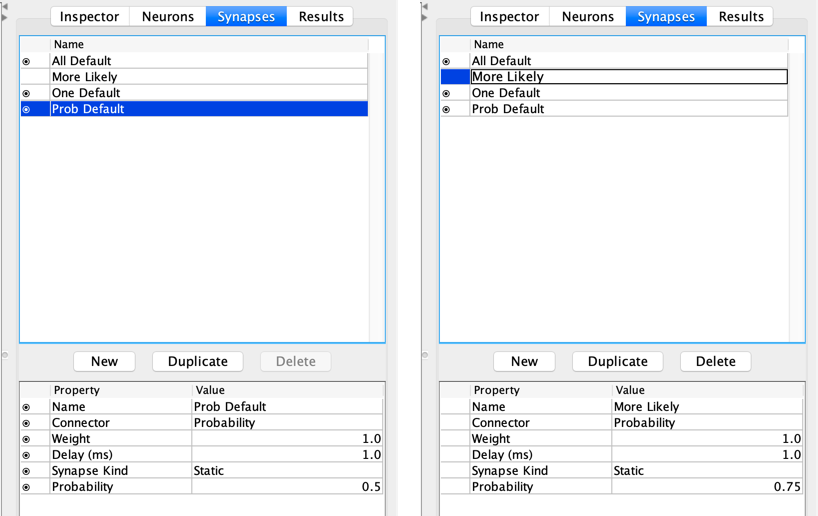
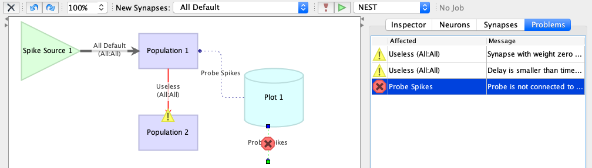

# Overview

**NeuroCoCoon** is a **protective** development environment and experimentation **workbench** for
spiking neural networks (*SNN*s) running on **neuromorphic hardware**.

The network is described in a graph-based visual language and is built from **neuron populations** (nodes) and **synapse
connectors** (edges). User-defined **neuron types** and **synapse types** ensure consistent parameter choices for all
related parts of the network architecture. In addition, predefined **network modules** can be used as architectural
building blocks with external connection points (ports).

Networks can be simulated on the [NEST][NEST] software simulator, if NeuroCoCoon is running as a local application,
or on the [SpiNNaker and BrainScalesS][HBP-NMC] platforms of the European Horizon 2020 [Human Brain Project][HBP] (*HBP*),
if NeuroCoCoon is running as a client side web application inside the [HBP collaboratory][HBP-Collab].

# Editor Window

## Toolbar

## Editing the Network

### Creating Neuron Populations and Module Instances

### Adding Synapses

#### Drawing Synapses

#### Using Connect Mode

#### Dragging from the Palette

### Plotting Data

### Mouse Operations

### Important Menu Items

## Inspector

## Neuron and Synapse Types

## Running a Simulation

---

This open source software code was developed in part in the Human Brain Project, funded from the
European Union’s Horizon 2020 Framework Programme for Research and Innovation under the
Specific Grant Agreement No. 720270 (HBP SGA1) and 785907 (HBP SGA2).

[NEST]: https://www.nest-initiative.org
[HBP]: https://www.humanbrainproject.eu
[HBP-NMC]: https://www.humanbrainproject.eu/en/silicon-brains/neuromorphic-computing-platform/
[HBP-Collab]: https://collab.humanbrainproject.eu/