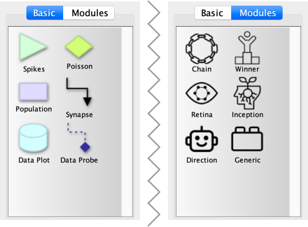
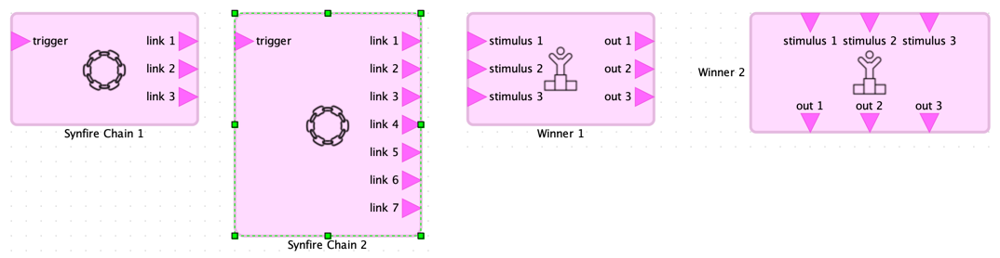

# Overview

**NeuroCoCoon** is a **protective** development environment and experimentation **workbench** for
spiking neural networks (*SNN*s) running on **neuromorphic hardware**.

The network is described in a graph-based visual language and is built from **neuron populations** (nodes) and **synapse
connectors** (edges). User-defined **neuron types** and **synapse types** ensure consistent parameter choices for all
related parts of the network architecture. In addition, predefined **network modules** can be used as architectural
building blocks with external connection points (ports).

Networks can be simulated on the [NEST][NEST] software simulator, if NeuroCoCoon is running as a local application,
or on the [SpiNNaker and BrainScalesS][HBP-NMC] platforms of the European Horizon 2020 [Human Brain Project][HBP] (*HBP*),
if NeuroCoCoon is running as a client side web application inside the [HBP collaboratory][HBP-Collab].

# Editor Window

The editor window consists of the following major parts:

1. **Toolbar** with buttons for the most important operations, some editor settings, and the
   simulation control elements. See the next section for more details.
   
2. **Palette** with basic elements and modules that can be added to the spiking neural network graph.

3. **Outline** view with a scaled-down overview of the full network graph.

4. **Main view** of the graph at a configurable scale. This will often only show a part of the full
   network, as indicated by the blue rectangle in the outline view.
   
5. **Details area** with several tabs that are used to display and edit different aspects of the
   network that are not directly visible or accessible in the visual representation of the graph in the main view.
 
## Toolbar

The toolbar at the top of the editor window comprises these distinct regions:

1. Buttons for operations at the document level. These correspond to menu items in the **File** menu.
   For the web application editor document files are stored in a simulated file system on the client
   machine. The native storage format (file extension `.ncc`) uses an XML-based representation of the
   graph that is annotated with all parameters of the network architecture. As an alternative, a
   Portable Network Graphics raster image (file extension `.png`) of the graph can be saved. This file
   embeds the aforementioned XML representation of the network and can be opened later for further editing.

2. Buttons for standard editing operations known from drawing applications and other editors in general.
   These correspond to menu items in the **Edit** menu.
   
3. Buttons to *undo* the last editing operation(s) or to *redo* previously undone operations.
   These operations are also available in the **Edit** menu.
   
4. Popup menu and input box to set the desired scale of the graph in the main viewing area below.

5. Popup menu of all *synapse types* defined in the current network architecture. This determines
   the parameters and settings used by new synapse connections added to the graph. The details area
   at the right of the window is used to define synapse types and to edit the parameters of existing
   synapses afterwards.
   
6. Buttons to check the current network architecture for structural and semantic errors and to run a
   simulation of the network. A network can only be simulated if it contains no errors, but warnings
   and information items concerning likely unintended parameter settings do not prevent simulation.
   
7. Popup menu to select the target platform for executing the simulation. Unavailable platforms are
   greyed out, i.e., the [SpiNNaker and BrainScalesS][HBP-NMC] platforms, if running as a local application,
   or the [NEST][NEST] software simulator, if running as a web application. Always available is the
   **Source only** platform, which does not actually execute the simulation, but just shows the generated
   [Python 3][Python3] [PyNN][PyNN] code for inspection.

8. Status summary display that tracks the progress and the general success or failure of checking a network
   architecture or running a simulation.
   This is complemented by longer messages in the status bar at the bottom of the editor window, by
   message dialog boxes, or by information in the **Results** tab of the detail area as needed.

## Editing the Network

Creating a network architecture in the NeuroCoCoon visual editor consists of the following general steps.

* Adding neuron populations or network modules to the graph by dragging them from the palette into the main view.
* Drawing synapse connections between the populations or the connection points (*ports*) of the modules.
* Attaching data plots with probe connections that monitor network behaviour of interest.
* Adjusting parameters of the currently selected network item in the **Inspector** tab of the details area.
* Checking the network architecture for errors and finally running a simulation of the network.

### Creating Neuron Populations and Module Instances

Neuron populations and spike sources are added as nodes to the network graph by dragging them from the **Basic** tab
of the palette into the main view. Their symbol in the palette is a miniature version of the visual representation
for the node in the graph.

The **Modules** tab of the palette contains one icon for each kind of module in the module library. A module instance
is added to the network graph by dragging the icon from the palette into the main view. Module instances appear in the
graph as pale violet rounded boxes that show the icon representing the module kind. Darker violet triangles represent
the input port and output ports of the module instance. These ports serve as connection points and the triangles point
towards the direction of the information flow, i.e., into the modular sub-network contained in the module instance or
out of that sub-network. 

The above figure shows on the left two module instances of the kind *Synfire Chain* where the length of the chain
has been set to three and seven stages respectively in the **Inspector** tab of the details area.
On the right there are two module instances of the kind *Winner-Take-All*, both set to select one of three possible
outcomes. However, the right instance has been flipped into a vertical flow direction (menu **Shape**>**Flip Module**)
with input port along the top border and output port along the bottom border, instead of there default location along
the left and right border respectively. This is a purely cosmetic choice to get a better general layout of the
visual network architecture. Similarly, the box for a module instance my be resized graphically to get a more
appropriate spacing between ports.
  
### Adding Synapses

Synapses are the most prevalent kind of edges in the network graph. Such an edge between two neuron populations usually
represent many connections between individual neurons inside those collections. The *synapse type* determines the
systematic strategy that is used to apply this conceptual high-level connection between populations at the neuron
level (the *connector*) and quantitative parameters of each such neuron connection, like the weight and the delay.
The synapse type for newly added synapses is determined by the corresponding popup menu in the the toolbar.
User-defined synapse types are created and managed in the *Synapses* tab of the details area.

There are the following three alternative ways to add synapses (and connecting edges in general) to the network graph.

#### Drawing Synapses

The usually most convenient way is to drag with the left mouse button from the center of the source node to the
center of the target node, as shown below. A green outline around the node indicates a mouse pointer location
close enough to the center of the node where starting to drag will create an edge. Similar behaviour applies to the
target node. A red outline indicates a node that is an invalid target and will not accept the pending connection.
Nodes that do not allow any kind of incoming or outgoing connections show no colored border at all.

By default you can also temporarily create dangling edges that are not yet attached to a target node. This allows you
to create especially very long edges in multiple steps. However, all such dangling edges must be connected to valid
nodes before the network can be simulated.

If you want to select a node for editing, moving, resizing, or to inspect its parameters, you must click outside the
center area of the node. This causes the usual dashed selection marker with resizing handles to appear.

#### Using Connect Mode

This mode can be turned on and off in the menu **Options**>**Connections**>**Connect Mode**. While this mode is active
(menu item ticked) a small green square marks the exact center of the node under the mouse pointer and drawing an
edge can only be started from there. With connect mode turned off the active center area of a node is much larger.

Contrary to its name, connect mode makes it slightly harder to create connections, but simplifies normal node selection
and editing. This is especially relevant, if you want to visually move node labels:
menu **Options**>**Labels**>**Move Node Labels**, turned off by default.

#### Dragging from the Palette

Finally, edges can be added to the graph, just like nodes, by dragging the desired kind of edge from the **Basic** tab
of the palette. After dropping the edge into the main view the two endpoints must the be dragged in separate steps to
attach them to graph nodes.

In the lower part of the above figure, the blue source handle of the synapse edge has already been attached to the
population on the left and the blue target handle is just about to be dropped onto the right population. The green
rectangle indicates that this connection will then be created, as its is structurally valid. The thin green line
provides a preview, how this connection will be routed.

Dragging edges from the palette is mainly useful, if you want to manually pick a specific kind of edge, .e.g., a
synapse connection versus a probe connection. Drawing synapses directly between nodes picks the most likely kind of
edge, if any valid kind exists, based on the source and target nodes involved.

### Plotting Data

Simulation results are provided in the form of plots that monitor spiking behaviour or continuous state variables of
selected neurons over the course of the simulation. Which neuron populations to mnitor and what data to collect is
also represented visually in the graph of the network.

TODO

### Mouse Operations

**Usage on macOS:** The listed modifier keys apply to the local application on the Linux/Unix and Windows platforms,
as well as to the web application. On macOS the \<Option> key replaces the \<Alt> key and the
\<Command> (or \<Cmd>) key is used instead of \<Ctrl>. This matches the general conventions for
modifier keys on that platform. The \<Ctrl> key is used on macOS only to simulate the right
mouse button with input devices that offer just a single button.

### Important Menu Items

## Inspector

## Neuron and Synapse Types

## Running a Simulation

---

This open source software code was developed in part in the Human Brain Project, funded from the
European Union’s Horizon 2020 Framework Programme for Research and Innovation under the
Specific Grant Agreement No. 720270 (HBP SGA1) and 785907 (HBP SGA2).

[NEST]: https://www.nest-initiative.org
[Python3]: https://www.python.org
[PyNN]: https://neuralensemble.org/PyNN
[HBP]: https://www.humanbrainproject.eu
[HBP-NMC]: https://www.humanbrainproject.eu/en/silicon-brains/neuromorphic-computing-platform/
[HBP-Collab]: https://collab.humanbrainproject.eu/